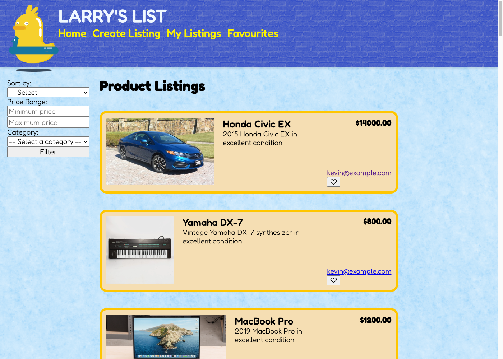
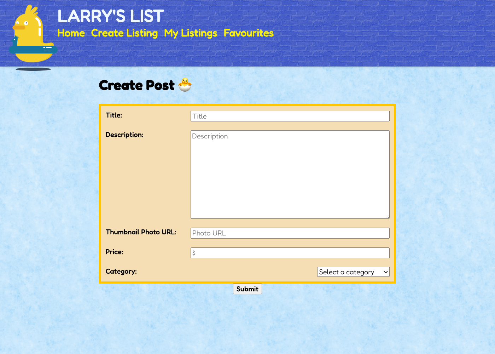
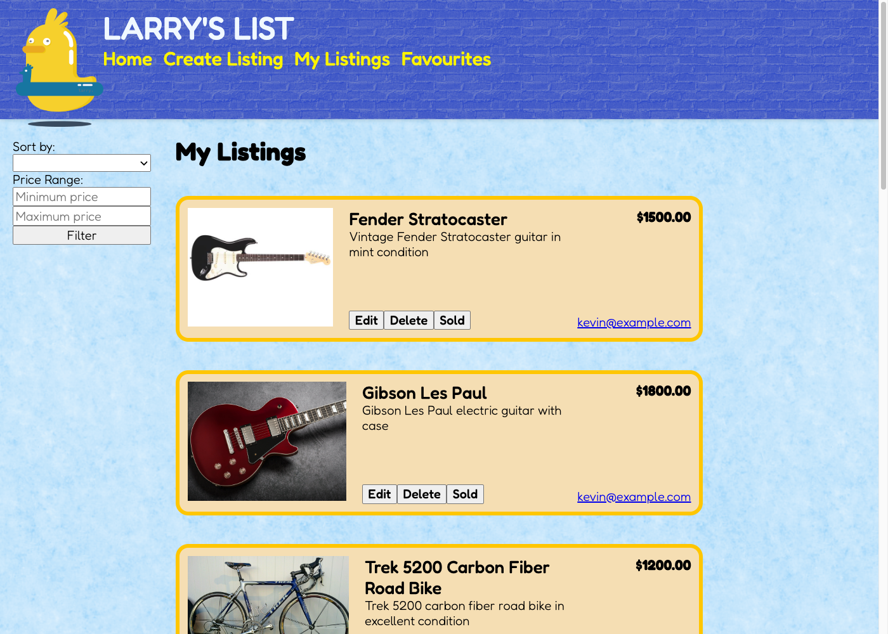
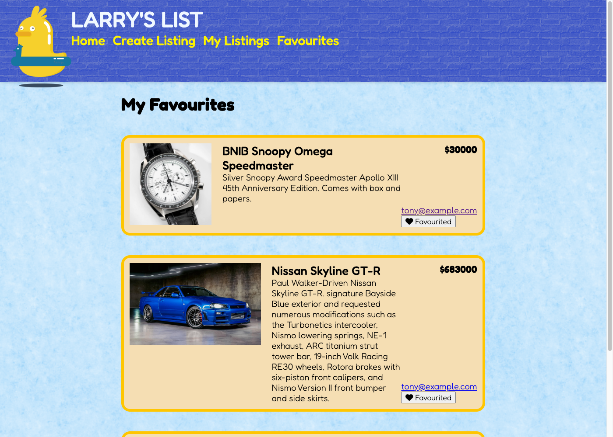
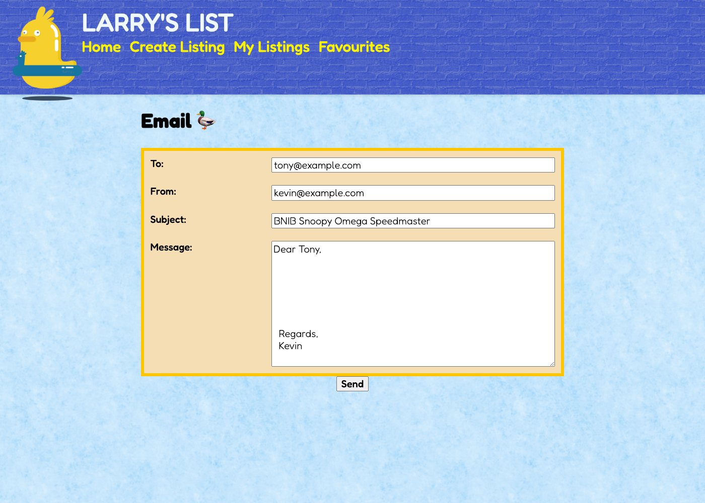
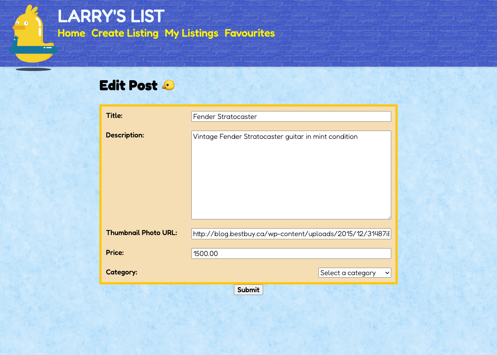
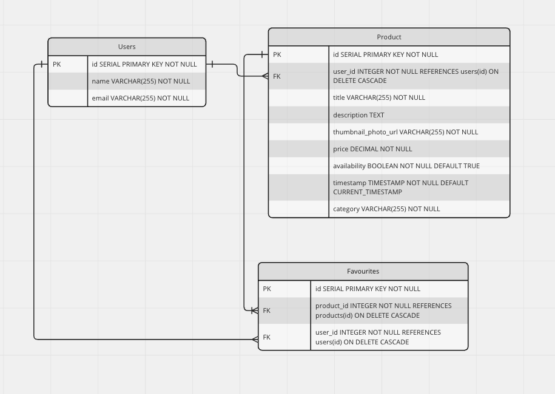

# Larry's List (Buy & Sell Website)

Larry's List is the modern-day answer to the popular classified ads website, Craigslist. With a sleek and user-friendly interface, Larry's List allows users to buy and sell items in their local area with ease. Larry's List is a refreshing take on the traditional classified ads model, with a modern twist that appeals to the needs and interests of a contemporary audience. Whether you're looking to buy or sell items in your local area, Larry's List has everything you need to make the process fast, easy, and enjoyable.

Credits to Lighthouse Labs mascot Larry for being our Logo for our project.

## Final Product

### Homepage



### Create Listing Page



### My Listings Page



### Favourites



### Contact User Page



#### Edit Post Page



## Larry's List ERD



## Project Structure

```
.
├── db
│   └── queries
│       ├── add-product.js
│       ├── delete-product.js
│       ├── edit-product.js
│       ├── filters-category.js
│       ├── filters-price-range.js
│       ├── filters-sort-price.js
│       ├── get-email-with-userid.js
│       ├── get-favourties.js
│       ├── get-product-by-userID.js
│       ├── get-user-with-cookieid.js
│       ├── mark-as-sold.js
│       └── update-products.js
├── public
│   └── scripts
│      ├── favourites-addDelete.js
│      ├── filters.js
│      └── scrollToTop.js
├── routes
│   ├── add-delete-favourites.js
│   ├── createform.js
│   ├── deleteProduct.js
│   ├── editform.js
│   ├── emailform.js
│   ├── favourites.js
│   ├── homepage.js
│   ├── login.js
│   ├── mylistings.js
│   ├── productfilters.js
│   └── sold.js
├── styles
│   ├── header.scss
│   ├── homepage.scss
│   ├── inputForm.scss
│   ├── main.scss
│   └── scrollToTop.scss
├── views
│   │   └── Partials
│   │       └── header.ejs
│   ├── createform.ejs
│   ├── editform.ejs
│   ├── favourites.ejs
│   ├── homepage.ejs
│   └── mylistings.ejs
├── .gitignore
├── package-lock.json
├── package.json
├── Project-Plan.md
├── README.md
└── server.js
```

- `db` contains all the database interaction code.
  - Queries folder contains all queries to the database. 
- `public` contains all of the HTML, CSS, and client side JavaScript.
- `routes` contains the router files which are responsible for any HTTP requests.
- `styles` contains all of the sass files.
- `server.js` is the entry point to the application. This connects the routes to the database.

## Getting Started

1. Create the `.env` by using `.env.example` as a reference: `cp .env.example .env`
2. Update the .env file with your correct local information 
  - username: `labber` 
  - password: `labber` 
  - database: `midterm`
  - APIKEY: `API_KEY`
3. Install dependencies: `npm i`
4. Fix to binaries for sass: `npm rebuild node-sass`
5. Reset database: `npm run db:reset`
  - Check the db folder to see what gets created and seeded in the SDB
7. Run the server: `npm run local`
  - Note: nodemon is used, so you should not have to restart your server
8. Visit `http://localhost:8080/`

## Warnings & Tips

- Do not edit the `.css` file directly, it is auto-generated by `.scss`.
- Split routes into their own resource-based file names, as demonstrated with `users.js` and `widgets.js`.
- Use the `npm run db:reset` command each time there is a change to the database schema or seeds. 
  - It runs through each of the files, in order, and executes them against the database. 
  - Note: you will lose all newly created (test) data each time this is run, since the schema files will tend to `DROP` the tables and recreate them.

## Dependencies

- Node 10.x or above
- NPM 5.x or above
- PG 6.x
- @sendgrid/mail
- chalk
- cookie-session
- dotenv
- ejs
- express
- morgan
- sass
